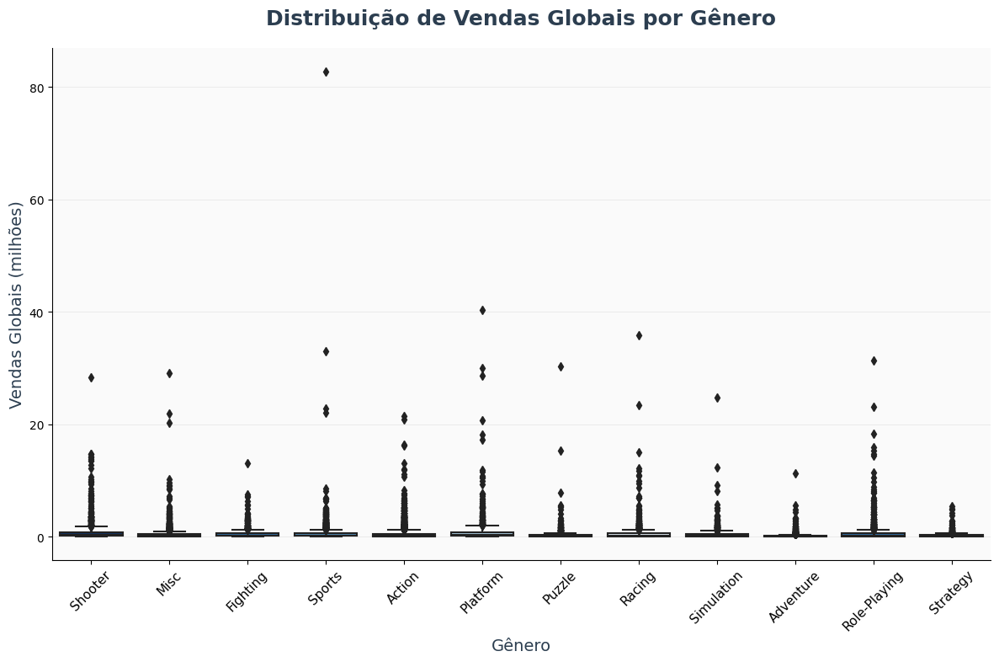
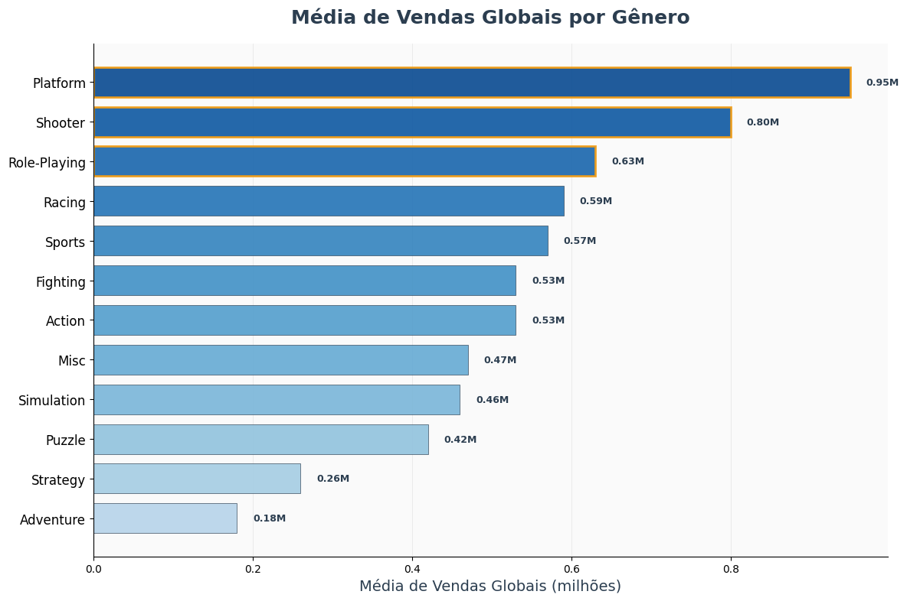
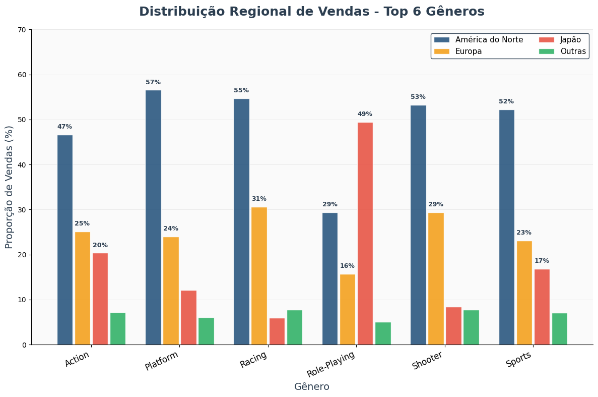

# Análise Exploratória de Dados - Vendas Globais de Jogos Eletrônicos

## Objetivo do Projeto

Este projeto realiza uma análise exploratória dos dados de **vendas globais de jogos eletrônicos**, com foco em dois aspectos principais:

1. **Análise de gêneros por volume de vendas** - Identificação dos gêneros mais lucrativos do mercado
2. **Padrões regionais de preferência** - Comparação de consumo entre América do Norte, Europa e Japão

O objetivo é extrair insights estratégicos que possam orientar decisões de desenvolvimento, marketing e investimento na indústria de games, utilizando técnicas de ciência de dados e visualização para apoiar tomadas de decisão baseadas em evidências.

## Estrutura do Projeto

```
analise-vendas-jogos/
├── dataset/                              # Dados do projeto
│   ├── vgsales_new.csv                   # Dataset original (Kaggle)
│   ├── dataset_corrigido.csv             # Dataset após limpeza
│   ├── vgsales_final.csv                 # Dataset final com transformações
│   └── valores_unicos_coluna.xlsx        # Análise de publishers padronizados
├── docs/                                # Documentação
│   └── relatorio_analise.pdf             # Relatório completo da análise
├── plots/                               # Visualizações geradas
│   ├── grafico_1_boxplot_genero.png      # Q1: Distribuição por gênero
│   ├── grafico_2_medias_genero.png       # Q1: Médias de vendas por gênero
│   ├── grafico_3_heatmap_regional.png    # Q2: Padrões regionais (heatmap)
│   └── grafico_4_barras_agrupadas.png    # Q2: Comparação regional detalhada
├── notebooks/                           # Notebooks de análise
│   ├── 01_exploracao_inicial.ipynb      # Exploração inicial dos dados
│   ├── 02_limpeza_dados.ipynb           # Pré-processamento e limpeza
│   ├── 03_transformacao.ipynb           # Transformações e feature engineering
│   └── 04_analise_principal.ipynb       # Análise exploratória completa
├── requirements.txt                     # Dependências do projeto
├── .gitignore                          # Arquivos ignorados pelo Git
└── README.md                           # Este arquivo
```

## Dataset e Variáveis

### Fonte dos Dados
Dataset obtido da plataforma **Kaggle** (originalmente do vgchartz.com via web scraping) contendo **16.598 registros** de jogos que venderam mais de 100 mil cópias globalmente.

**Link da fonte:** https://www.kaggle.com/datasets/willianoliveiragibin/video-game-sales-analyze

### Variáveis Principais

| Variável | Tipo | Descrição |
|----------|------|-----------|
| **Name** | Categórica | Nome do jogo |
| **Platform** | Categórica | Console/plataforma de lançamento |
| **Genre** | Categórica | Gênero do jogo (12 categorias) |
| **Publisher** | Categórica | Empresa publicadora |
| **Year** | Numérica | Ano de lançamento |
| **NA_Sales** | Numérica | Vendas na América do Norte (milhões) |
| **EU_Sales** | Numérica | Vendas na Europa (milhões) |
| **JP_Sales** | Numérica | Vendas no Japão (milhões) |
| **Other_Sales** | Numérica | Vendas em outras regiões (milhões) |
| **Global_Sales** | Numérica | Vendas globais totais (milhões) |
| **Rank** | Numérica | Ranking global de vendas |

### Variáveis Derivadas (Feature Engineering)

| Variável | Descrição |
|----------|-----------|
| **Decade** | Década de lançamento (1980, 1990, 2000, 2010) |
| **%NA_Sales, %EU_Sales, %JP_Sales, %Other_Sales** | Proporções regionais das vendas totais |
| **Normalized_Sales** | Vendas normalizadas usando MinMaxScaler (0-1) |
| **Cluster** | Agrupamento por padrão de vendas (K-means com 3 clusters) |

## Tecnologias e Dependências

### Linguagem e Ambiente
- **Python 3.11+**
- **Jupyter Notebook** para análise interativa
- **Ambiente Virtual** recomendado

### Bibliotecas Utilizadas

| Biblioteca | Versão | Função |
|------------|--------|--------|
| **pandas** | 2.1+ | Manipulação e análise de dados |
| **numpy** | 1.24+ | Operações matemáticas e arrays |
| **matplotlib** | 3.7+ | Criação de visualizações estáticas |
| **seaborn** | 0.12+ | Visualizações estatísticas avançadas |
| **scikit-learn** | 1.3+ | Clusterização K-means, PCA e MinMaxScaler |
| **scipy** | 1.11+ | Análises estatísticas e correlações |

## Configuração do Ambiente

### 1. Clone do Repositório
```bash
git clone https://github.com/DiegoMonutti/analise-vendas-jogos.git
cd analise-vendas-jogos
```

### 2. Criação do Ambiente Virtual
```bash
python -m venv venv
source venv/bin/activate  # Linux/Mac
# ou
venv\Scripts\activate     # Windows
```

### 3. Instalação das Dependências
```bash
pip install -r requirements.txt
```

### 4. Inicialização do Jupyter
```bash
jupyter notebook
# ou
jupyter lab
```

## Pipeline de Análise de Dados

O projeto segue um pipeline estruturado em 4 etapas principais:

### 1. 🔍 Exploração Inicial (`01_exploracao_inicial.ipynb`)
- Carregamento e inspeção do dataset original (16.598 × 11)
- Análise das dimensões e tipos de dados
- Verificação de estatísticas descritivas básicas
- Identificação de valores ausentes e duplicatas

### 2. 🧹 Pré-processamento (`02_limpeza_dados.ipynb`)
- **Tratamento de valores ausentes**: Remoção de 271 registros em 'Year' e 58 em 'Publisher'
- **Conversão de tipos**: Year float64 → int64 para análises temporais
- **Padronização de publishers**: Unificação de empresas (ex: Sony, Square Enix, 989 Sports → Sony)
- **Verificação de duplicatas**: Confirmação de dataset limpo
- **Output**: `dataset_corrigido.csv`

### 3. 🔄 Transformação dos Dados (`03_transformacao.ipynb`)
- **Feature Engineering**: Criação da variável 'Decade' para análises temporais
- **Cálculo de proporções**: Vendas regionais relativas ao total global
- **Normalização**: Aplicação do MinMaxScaler para padronizar vendas (0-1)
- **Agregações**: Estatísticas por gênero, plataforma, década e publisher
- **Clusterização**: K-means (3 clusters) + PCA para identificação de padrões
- **Output**: `vgsales_final.csv`

### 4. 📊 Análise Exploratória (`04_analise_principal.ipynb`)
- Execução das 2 perguntas de pesquisa definidas
- Geração de visualizações de alta qualidade (300 DPI)
- Cálculo de estatísticas descritivas e inferenciais
- Exportação automática de gráficos em PNG

## Perguntas de Pesquisa e Metodologia

### Q1 - Gêneros com Maiores Volumes de Vendas

**Questão**: Quais gêneros de jogos apresentam, em média, os maiores volumes de vendas globais?

**Metodologia**:
- Variáveis analisadas: Global_Sales por Genre
- Estatísticas: Média, mediana, desvio padrão e quantidade de jogos
- Visualizações: Boxplot de distribuição + gráfico de barras das médias
- Análise de variabilidade e identificação de outliers

### Q2 - Diferenças Regionais por Gênero

**Questão**: Existem diferenças relevantes de preferência por gênero entre as regiões (América do Norte, Europa, Japão)?

**Metodologia**:
- Variáveis: Proporções regionais (%NA_Sales, %EU_Sales, %JP_Sales) por Genre
- Cálculo de proporções médias por região e gênero
- Visualizações: Heatmap de correlações + gráfico de barras agrupadas
- Análise de disparidades e padrões culturais

## Resultados da Análise

### 🏆 Q1 - Gêneros com Maiores Volumes de Vendas Globais





**Resultados**:

| Gênero | Média (M) | Mediana (M) | Desvio Padrão | Qtd. Jogos | Participação |
|--------|-----------|-------------|---------------|------------|--------------|
| **Platform** | 0,95 | 0,28 | 2,60 | 875 | 9,41% |
| **Shooter** | 0,80 | 0,23 | 1,83 | 1.262 | 11,65% |
| **Role-Playing** | 0,63 | 0,19 | 1,72 | 1.470 | 10,48% |
| **Racing** | 0,59 | 0,19 | 1,68 | 1.225 | 8,25% |
| **Sports** | 0,57 | 0,22 | 2,10 | 2.304 | 14,86% |
| **Action** | 0,53 | 0,19 | 1,17 | 3.251 | 19,55% |

**Interpretação e Análise**:
- **Platform** apresenta o maior volume médio de vendas globais (0,95 milhões), seguido por **Shooter** (0,80 milhões) e **Role-Playing** (0,63 milhões)
- **Adventure** (0,18 milhões) e **Strategy** (0,26 milhões) apresentaram as menores vendas médias, indicando nichos específicos
- Alta variabilidade em **Platform** (desvio padrão 2,60) sugere presença de títulos excepcionais que elevam a média
- **Action** domina em quantidade de títulos (19,55%) mas com menor retorno médio por título
- A discrepância entre média e mediana confirma a natureza assimétrica do mercado de jogos

**Conclusão**: Platform oferece maior potencial de retorno médio, mas com alto risco devido à variabilidade extrema. Action e Sports representam mercados saturados com muitos títulos competindo.

---

### 🌍 Q2 - Diferenças Regionais de Preferência por Gênero




**Resultados**:

| Gênero | América do Norte | Europa | Japão | Outras Regiões |
|--------|------------------|--------|-------|----------------|
| **Platform** | 60% | 20% | 10% | 10% |
| **Puzzle** | 60% | 20% | 20% | 0% |
| **Action** | 50% | 30% | 20% | 10% |
| **Role-Playing** | 30% | 20% | **50%** | 10% |
| **Adventure** | 30% | 20% | **50%** | 0% |
| **Fighting** | 40% | 20% | **40%** | 10% |
| **Strategy** | 30% | 30% | 30% | 10% |

**Interpretação e Análise**:
- **América do Norte** domina Platform (60%) e Puzzle (60%), indicando preferência por entretenimento acessível e familiar
- **Japão** lidera Role-Playing (50%) e Adventure (50%), refletindo cultura de narrativa complexa e progressão
- **Europa** mantém distribuição equilibrada (20-30%) em múltiplos gêneros, sugerindo mercado diversificado
- **Outras regiões** mostram baixa participação (0-10%), representando mercados emergentes

**Maiores Diferenças Regionais**:
- Platform: NA (60%) vs JP (10%) = 50 pontos percentuais de diferença
- Role-Playing: JP (50%) vs Other (10%) = 40 pontos percentuais
- Strategy apresenta menor variabilidade regional (distribuição uniforme)

**Conclusão**: Existem diferenças culturais significativas nas preferências regionais. América do Norte favorece jogos casuais, Japão prioriza narrativa e profundidade, Europa absorve múltiplos gêneros, e outras regiões representam oportunidades de crescimento.

## Insights Estratégicos Principais

### Para Desenvolvedores
1. **Gêneros de alto retorno**: Platform oferece maior potencial médio (0,95M), mas com risco elevado
2. **Equilíbrio risco-retorno**: Shooter e RPG apresentam boa performance com menor variabilidade
3. **Segmentação regional**: RPG para mercado japonês, Platform para América do Norte
4. **Mercados saturados**: Action e Sports têm alta competição (19,55% e 14,86% dos títulos)

### Para Editoras e Publishers
1. **Marketing regionalizado**: Estratégias devem ser culturalmente adaptadas por região
2. **Portfólios diversificados**: Europa absorve bem múltiplos gêneros simultaneamente
3. **Oportunidades emergentes**: Outras regiões (0-10%) apresentam baixa penetração
4. **Campanhas globais**: Strategy tem distribuição uniforme, permitindo abordagem global

### Para Investidores
1. **Diversificação necessária**: Alta variabilidade exige portfólios balanceados
2. **Especialização regional**: Japão representa nicho em narrativa complexa
3. **Mercado casual**: América do Norte favorece entretenimento acessível
4. **Potencial inexplorado**: Mercados emergentes com menor concorrência

## Como Executar a Análise Completa

### Execução Sequencial dos Notebooks

1. **Exploração inicial**:
   ```bash
   jupyter notebook notebooks/01_exploracao_inicial.ipynb
   ```

2. **Limpeza dos dados**:
   ```bash
   jupyter notebook notebooks/02_limpeza_dados.ipynb
   ```

3. **Transformações**:
   ```bash
   jupyter notebook notebooks/03_transformacao.ipynb
   ```

4. **Análise principal**:
   ```bash
   jupyter notebook notebooks/04_analise_principal.ipynb
   ```

## Arquivos Gerados

### Datasets Processados
- `dataset/dataset_corrigido.csv` - Dataset limpo sem valores ausentes
- `dataset/vgsales_final.csv` - Dataset final com features engineered e clusters

### Visualizações de Alta Qualidade (300 DPI)
- `plots/grafico_1_boxplot_genero.png` - Distribuição de vendas por gênero
- `plots/grafico_2_medias_genero.png` - Comparativo de médias por gênero
- `plots/grafico_3_heatmap_regional.png` - Padrões de preferência regional
- `plots/grafico_4_barras_agrupadas.png` - Comparação regional detalhada

### Documentação Complementar
- `docs/relatorio_analise.pdf` - Relatório técnico completo com interpretações estatísticas

## Metodologia Aplicada

### 1. Pré-processamento Rigoroso
- **Limpeza**: Tratamento sistemático de valores ausentes e inconsistências
- **Padronização**: Unificação de publishers considerando fusões e rebrandings históricos
- **Validação**: Verificação de integridade e consistência dos dados

### 2. Feature Engineering Avançado
- **Variáveis temporais**: Criação de décadas para análise de tendências
- **Proporções regionais**: Cálculo de participação relativa por mercado
- **Normalização**: MinMaxScaler para comparações equilibradas
- **Clusterização**: K-means para identificação de padrões não supervisionados

### 3. Análise Estatística Robusta
- **Medidas de posição**: Média, mediana para diferentes perspectivas
- **Variabilidade**: Desvio padrão para análise de risco e dispersão
- **Análise de outliers**: Identificação de casos excepcionais via boxplots
- **Redução de dimensionalidade**: PCA para visualização de clusters

## Limitações e Trabalhos Futuros

### Limitações Identificadas
- **Dados temporais**: Poucos registros após 2016 (necessária atualização para tendências atuais)
- **Mercados emergentes**: Subrepresentação de regiões como América Latina, Ásia (exceto Japão)
- **Plataformas modernas**: Ausência de dados de jogos mobile e plataformas de streaming

### Extensões Propostas
1. **Análise temporal**: Investigação de sazonalidade e ciclos de lançamento
2. **Correlação qualidade-vendas**: Incorporação de dados de review (Metacritic, Steam)
3. **Modelagem preditiva**: Desenvolvimento de modelos de previsão de sucesso comercial
4. **Análise de precificação**: Relação entre preço de lançamento e performance
5. **Segmentação avançada**: Análise de micro-segmentos e nichos específicos

---

## Informações do Projeto

**Autor**: Diego Monutti de Souza  
**Instituição**: Universidade Tecnológica Federal do Paraná - Campus Dois Vizinhos  
**Curso**: Especialização em Ciência de Dados  
**Data**: Agosto 2025

**Contatos**:
- **Email**: diego_monutti@outlook.com
- **LinkedIn**: [linkedin.com/in/diego-monutti](https://www.linkedin.com/in/diego-monutti/)
- **GitHub**: [github.com/DiegoMonutti](https://github.com/DiegoMonutti)

---

*Este projeto foi desenvolvido como parte da disciplina de Análise Exploratória de Dados, demonstrando aplicação prática de técnicas de ciência de dados na análise de mercado da indústria de jogos eletrônicos.*